import Tabs from '@theme/Tabs';
import TabItem from '@theme/TabItem';

# Points

## Overview

A point in this context refers to a 2D point `[x,y]` with a rotation/orientation `r` and some extra metadata added in.
These can be thought of as the middle points of the keycaps in a resulting keyboard layout, with the additional handling of the angle of the keycap, plus, again, some metadata (like names, row/column information, custom variables, etc.).

The basic coordinate system works just like your math workbooks did: X values are positive to the right, negative to the left, while Y values are positive upward, negative downward.
Additionally, rotation represents the direction of the Y axis, and changes to it work counter-clockwise (so +90° turns to the left, while -90° turns to the right).
Throughout this doc, we'll often reference points in the form `[x, y, r°]`.

<div style={{textAlign: 'center'}}>

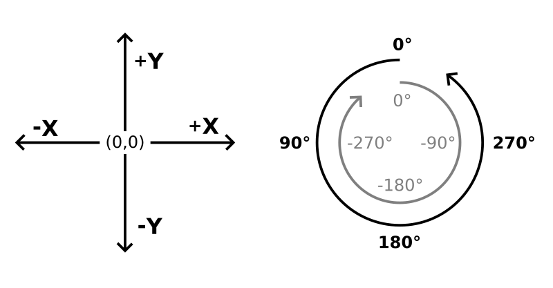

</div>

Points are an important part of keyboard creation as they can later be used to position shapes (to form board outlines) and PCB footprints &ndash; optionally by using filters to use only a subset.
But thing would get pretty tedious if we had to lay out each point manually, and downright horrific if any kind of trigonometry came into play!
So Ergogen tries to do as much of the heavy lifting as it can while providing more comfortable declaration alternatives.


## Anchors

One of these alternatives is the use of anchors, where we don't *directly* specify a point's `x`/`y`/`r` coordinates, but compute them from an already existing starting point through some translation/rotation/adjustment.
Of course, direct point declarations are also possible when starting from `[0, 0, 0°]` and translating/rotating right to where you want the point to be, but we can do better than that.
Anchors try to be very flexible, and it naturally comes with some complexity &ndash; but remember that they are just another way to declare a point.

Anchors can be parsed from the following data types:

- A ***string*** means it's just a reference to an already existing point with that name, without any further modifications.

- An ***array*** means it's a multipart anchor (or, multi-anchor), each item being an anchor itself, recursively.
  But why would we need multiple anchors for a single point, you might ask.
  Because each sub-anchor becomes the starting point of the next.
  
  :::tip
  Think of this as a kind of treasure hunt where you first have to find a clue to know where the next clue will be.
  Through this *follow-the-dots* functionality, you can get to many interesting, exact locations on your board without having to actually calculate where that is.
  :::

- An ***object*** means it's a full anchor declaration.


### Attributes

In a full, object anchor declaration, the following fields can be used:

- **`ref`** is the starting point from where the anchor will perform its additional modifications.
  This field is parsed as an anchor itself, recursively.
  So in its easiest form, it can be a string to designate an existing starting point by name (more on names [later](#keys)), but it can also be a full nested anchor if so desired.

- **`aggregate`** is an alternative to `ref` when the combination of several locations is required as the starting point for further adjustment.
  They're mutually exclusive, so we can use either `ref` or `aggregate` in any given anchor.
  The aggregate field is always an object, containing:

  - a `parts` array containing the sub-anchors we want to aggregate, and 
  - a `method` string to indicate *how* we want to aggregate them.

  The only method implemented so far is `average`, which is the default anyway, so the `method` can be omitted for now.

  :::note
  Averaging applies to both the `x`/`y` coordinates *and* the `r` rotation.
  :::

- **`orient`** is a kind of pre-rotation, meaning it happens before any shifting is done.
  The value can be:

  - a ***number***, in which case that number is simply added to the current rotation of the in-progress point calculation; or
  - a ***sub-anchor***, in which case the point "turns towards" the point we reference (meaning its rotations will be exactly set to hit that point if a line was projected from it).

  <br/>

  :::note
  Orienting only affects the `r` value of the point we're calculating.
  :::

- **`shift`** is for shifting (or, more formally, translating) the point on the XY plane.
  The value can be:

  - a ***array of exactly two numbers***, specifying the `x` and `y` shift, respectively, or
  - a single ***number***, which would get parsed as `[number, number]`.

  <br/>

  :::caution
  It's important that shifting happens according to the current rotation of the point.
  By default, a 0° rotation is "looking up", so that positive `x` shifts move it to the right, negative `x` shifts to the left, positive `y` shifts up, negative `y` shifts down.
  But if r=90° (so the point is "looking left", as, remember, rotation works counter-clockwise), then a positive `x` shift would move it upward.
  :::

- **`rotate`** is a kind of *post*-rotation after shifting, as opposed to how `orient` was the *pre*-rotation.
  Otherwise, it works the exact same way.

- **`affect`** can specify an override to what fields we want to affect during the current anchor calculation.
  The value can be:

  - a ***string*** containing a subset of the characters `x`, `y`, or `r` only; or
  - an ***array*** containing a subset of the one letter strings `"x"`, `"y"`, or `"r"` only.

  <br/>

  :::tip
  Let's say you have a point rotated 45° and want to shift is "visually right". You could either reset its rotation via `orient`, then shift, then reset the rotation with `rotate`; or, you could do the shift and then declare that this whole anchor only `affect`s `"x"`. The *amount* of shifting wouldn't be the same, but the important thing is that you could constrain the movement to the X axis this way.

  Or let's say you want to copy the rotation of another, already existing point into your current anchor calculation. You can do so using a multi-anchor (see above), `ref`erencing the existing point in the second part, and then declare `affect: "r"` to prevent it from overwriting anything else, thereby setting just the rotation.
  :::

- **`resist`** states that we do **not** want the special treatment usually afforded to mirrored points.
  We'll get to [mirroring](#mirroring) in a second, but from an anchor perspective, all we need to know is that shifting and orienting/rotating are all mirrored for mirrored points, to keep things symmetric.
  So if we specify a shift of `[1, 1]` on a mirrored point, what actually gets applied is `[-1, 1]`, and rotations are clockwise (read, **counter**-counter-clockwise) in those cases, too.
  But if we don't want this behavior, (say, because PCB footprints go on the same, upward facing side of the board, no matter the half) we can `resist` the special treatment.


### Examples

<details><summary>Basic</summary>
<p>

To get the gist of what's happening, take a look at the following anchor config and its visualization.
It first orients itself 45°, then it shift "one to the right", but since its orientation is now 45°, "right" means "up and to the right" along the diagonal line.
Once it gets there (at [&radic;2/2, &radic;2/2], on the unit circle), it finally rotates another 135°, which (when added to its existing rotation) results is 180°, so it's looking "down".

<Tabs>
<TabItem value="config" label="Config" default>

```yaml
anchor:
  orient: 45
  shift: [1, 0]
  rotate: 135
```

</TabItem>
<TabItem value="visualization" label="Visualization">
<div style={{textAlign: 'center'}}>

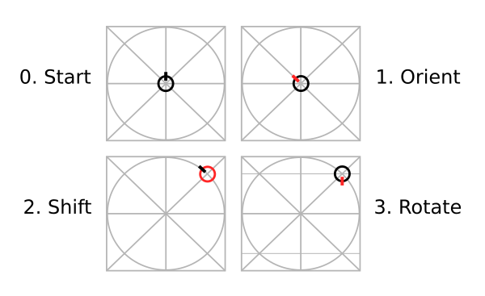

</div>
</TabItem>
</Tabs>

</p>
</details>

<details><summary>Follow-the-dots</summary>
<p>

We can now turn towards multi-anchors, which are just regular anchors in an array.
Arrays in YAML are denoted by using the dash (`-`) notation and an extra level of indent.
The first item is the same as above, meaning we're starting from the same situation as the basic example.
Only now, the result of the basic example won't be the end, only the starting point of a second anchor component.

Shifting with a positive `x` coordinate usually means "visually right", but remember that our starting point (resulting from the first sub-anchor) faces down, so positive `x` values here mean "visually left".

On top of this, we demonstrate how `rotate` (or `orient`) works when given a sub-anchor instead of a number, turning towards the center, automatically calculating the degrees of rotation it requires.
Hopefully this demonstrates how easy it is to get to very non-obvious coordinates using nice "round" numbers only &ndash; no &pi; in sight!
For the record, the final result is a point at `[-0.293, 0.707, -157.5°]`.

<Tabs>
<TabItem value="config" label="Config" default>

```yaml
anchor:
  - orient: 45
    shift: [1, 0]
    rotate: 135
  - shift: [1, 0]
    rotate.shift: [0, 0]
```

</TabItem>
<TabItem value="visualization" label="Visualization">
<div style={{textAlign: 'center'}}>

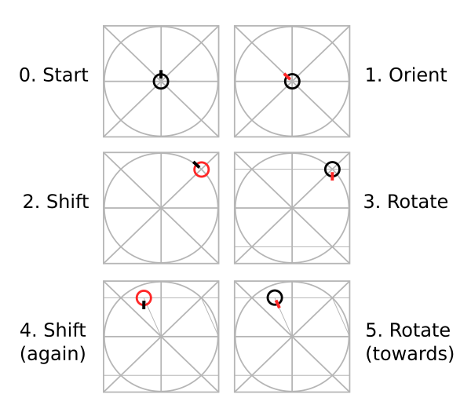

</div>
</TabItem>
</Tabs>

</p>
</details>

<details><summary>Averaging</summary>
<p>

Here we can see how to aggregate two existing points.
`left` is at `[-1, 0, -90°]`, marked green, while `right` is at `[1, 0, 90°]`, marked blue.
Aggregating without a `method` defaults to `average`, so what we get as our aggregated point is the good 'ol `[0, 0, 0°]` that we would have started with anyway.
Note that the rotation also got averaged, not just the `x`/`y` coordinates.

From here on out, it's the same as if we `ref`erenced a single existing starting point, or left it empty for the default `[0, 0, 0°]`.
We can perform any additional shifting or rotating, make this a part of a multi-anchor, whatever...

<Tabs>
<TabItem value="config" label="Config" default>

```yaml
anchor:
  aggregate.parts:
    - left
    - right
  shift: [1, 0]
  rotate: 180
```

</TabItem>
<TabItem value="visualization" label="Visualization">
<div style={{textAlign: 'center'}}>


</div>
</TabItem>
</Tabs>

</p>
</details>

<details><summary>Affecting</summary>
<p>

Let's say we have an existing point at `[-1, 0, 45°]`, fittingly named `existing`, and we want a new point "facing the other way".
It would be easy to add 180° to its rotation, if we knew it &ndash; but as we saw in previous examples, some coordinate values are not exactly round numbers and using them would be easier through calculation.
Fortunately, we don't have to recalculate it, either.
We can just `ref`erence the existing point, and then pick-and-choose what we want to reuse from it using `affect`.

So we get a multi-anchor going by first shifting our point to where we want it to be on the x/y plane, then adding a second part that `ref`s the existing point and make some further adjustments.
Normally, specifying a `ref` would overwrite all progress we've made so far, but `affect` to the rescue.

<Tabs>
<TabItem value="config" label="Config" default>

```yaml
anchor:
  - shift: [0, 1]
  - ref: existing
    rotate: 180
    affect: r
```

</TabItem>
<TabItem value="visualization" label="Visualization">
<div style={{textAlign: 'center'}}>

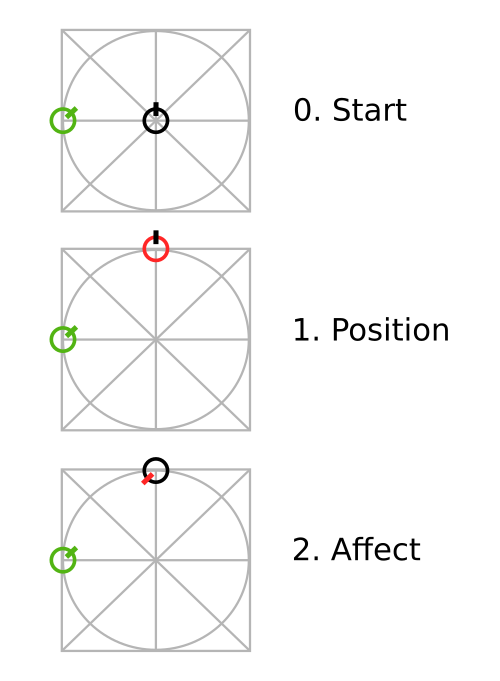

</div>
</TabItem>
</Tabs>

</p>
</details>

<details><summary>Resisting</summary>
<p>

Let's take the same starting point we have in the Averaging example, only now the existing points are not separate, but mirror images of each other, named `left` at `[-1,0,-90°]` (green) and `mirror_left` at `[1,0,90°]` (blue).
Read more on [mirroring](#mirroring) later.

So, if we do an ordinary right shift and some counter-clockwise (positive) rotation on a "normal" point, we get the normal result.
Remember, though, that since `left` is facing towards the middle, a "rightward" shift from its perspective is going to be moving "visually down" (see 1).

Now the interesting part: when we do the same "rightward" shift + positive rotation on a mirrored point, what actually happens is a seemingly leftward shift and a negative rotation, to keep the mirror image in sync with its source (see 2).

If we don't want this, we can specify the same with an additional `resist: true` and now the mirrored point will also do a rightward shift (from its perspective!) and counter-clockwise rotation (see 3).

<Tabs>
<TabItem value="config" label="Config" default>

```yaml
# 1, default non-mirrored case
anchor_1:
  ref: left
  shift: [1, 0]
  rotate: 45

# 2, default mirrored case
anchor_2:
  ref: left_mirror
  shift: [1, 0]
  rotate: 45

# 3, mirrored case with resistance
anchor_3:
  ref: left_mirror
  shift: [1, 0]
  rotate: 45
  resist: true
```

</TabItem>
<TabItem value="visualization" label="Visualization">
<div style={{textAlign: 'center'}}>

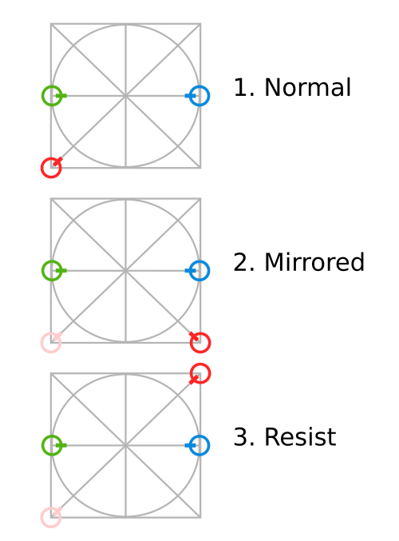

</div>
</TabItem>
</Tabs>

</p>
</details>


## Zones

Anchors are a great way to dial in the exact position of a single point, but they would be cumbersome for whole keyboards.
So while you'll be using anchors all the time in sub-fields of your config, the main approach to define batches of points is through the use of `zones`.

### Basics

I'm probably not revealing a big secret if I confess that "Ergogen" is just a contraction of "Ergonomic Generator".
And what makes it "Ergo" is its opinionated, explicit focus on the column-stagger.
This means that instead of the more common rows-then-columns order, Ergogen lays out zones columns first, left-to-right by default.
A collection of columns comprises a zone, and we can have as many zones as we'd like &ndash; for example, to differentiate the keywell and the thumb fan/cluster.
Columns can be staggered and splayed relative to each other, while zones can be anchored to each other so that everything is right where you want it.
Within columns, the rows are built from bottom to top by default.

A full zone declaration looks something like this (in the context of the whole config):

```yaml
points:
  zones:
    <zone_name>: # A unique key for each zone
      anchor: # Optional anchor to position the zone, default = [0, 0, 0°]
      columns: 
        <column_name>: # A unique key for each column within the zone
          rows:
            <row_name>: <defs> # Key-level attributes set here apply to this key alone
            ...
          key: <defs> # Key-level attributes set here apply to the whole column
        ...
      rows:
        <row_name>: <defs> # Key-level attributes set here apply to the whole row
        ...
      key: <defs> # Key-level attributes set here apply to the whole zone
    ...
  key: <defs> # Key-level attributes set here apply to ALL zones
```

### Inheritance

As you can see, there are quite a few places where these so-called key-level attributes can be defined.
How are poor keys to know which to pay attention to, and which to ignore?
Enter inheritance, where (somewhat similarly to the usual programming concept of inheritance) we go from generic to specific, override what we must, and just reuse the rest.

The inheritance order goes:

1. Built-in, hardcoded defaults
2. Global `points.key` overrides
3. Zone-wide `points.zones.<zone_name>.key` overrides
4. Column-wide `points.zones.<zone_name>.columns.<column_name>.key` overrides
5. Row-wide `points.zones.<zone_name>.rows.<row_name>` overrides
6. Key-specific `points.zones.<zone_name>.columns.<column_name>.rows.<row_name>` overrides

All this complexity is only there to minimize the need for repetition.
We can freely choose the best place for any key-level attribute where it can apply to all its victims while being declared only once.
These sources "extend" each other in this order so by the time we reach a specific key, every level had an opportunity to modify something.

:::caution
As you might notice, levels 2-3-4 have a `.key` suffix while levels 5-6 do *not*!
This is because parent levels for the former three (`points`, `points.zones.<zone_name>` and `points.zones.<zone_name>.columns.<column_name>`, respectively) can have other content as well, while the latter two are exclusively for key-level attributes anyway.
:::

:::note
The higher the number before an override, the higher chance it has to override anything that came before it.
So values declared at the 6th, key-specific level are sacred and inviolable, while everything the user configures can override the lowly hardcoded defaults at level 1.
:::

For example, let's suppose that a key-related attribute is already defined at the column-level (at `points.zones.<zone_name>.columns.<column_name>.key`, so level 4).
When we later encounter a key-level extension for this key (at `points.zones.<zone_name>.columns.<column_name>.rows.<row_name>`, so level 6) that specifies a few things but not this exact key, its value will stay the same instead of disappearing.

:::note
When we **want** it to disappear, UN-specifying values is also possible with the `$unset` directive, because this key-level inheritance relies on the same implementation we've discussed in the [`preprocessing`](./preprocessing.md) section.

A common use-case for this is when you'd want to remove an additional pinky key.
You can still declare zone-wide bottom/home/top rows to apply to the ring/middle/index/inner columns, but for the pinky, you simply override as `pinky.rows.top: $unset` to be left with only two pinky keys.
:::

When multiple levels define the same attribute and there is a "collision", simple values (like booleans, numbers, or strings) replace the old ones, while composites (arrays or objects) apply this same extension mechanism recursively, element-wise.
So when `key = 1` is extended by `key = 2`, the result is `key = 2`.
But if `key = {a: 1}` is extended by `key = {b: 2}`, the result is `key = {a: 1, b: 2}`.
Lastly, if `key = {a: 1}` is extended by `key = {a: $unset, b: 2}`, the result is `key = {b: 2}`.


### Keys

Keys can contain any metadata as attributes (which may become useful later down the line), but only a handful has meaning when laying out positions.
These are the following:

- **`stagger`**:
  Column staggering means an extra vertical shift to the starting point of a whole column compared to the previous one (initially `0`, cumulative afterwards).
  Its default value is `0` (also overrideable with the `$default_stagger` internal variable).

- **`spread`**:
  Once a column has been laid out, `spread` (the horizontal space between this column and the next) is applied before the layout of the next column begins.
  Its default value is `u` (also overrideable with the `$default_spread` internal variable).

- **`splay`**:
  As a kind of companion to `spread`, `splay` applies a rotation (around an optional **`origin`**) to the starting point of a new column.
  Its default value is `0` (also overrideable with the `$default_splay` internal variable), and it rotates around the default origin of `[0, 0]` (meaning the center of where the first key in the column would go).

- **`padding`**:
  Once a point within a column is determined, `padding` represents the vertical gap between it and the next row.
  Its default value is `u` (also overrideable with the `$default_padding` internal variable).

- **`orient`** / **`shift`** / **`rotate`**:
  The names might be familiar from the anchor section.
  And indeed, they do behave very similarly &ndash; only they are interpreted **cumulatively** within a column.
  The current key `orients` (default = `0`), `shifts` (default = `[0, 0]`), and rotates (default = `0`), and in doing so, not only positions itself, but provides the starting point for the *next* row within the column (to which the above `padding` can be applied).

- **`adjust`**:
  This field is also used to adjust individual points &ndash; but, as opposed to the above trio, it's parsed as an actual anchor, and it applies **independently**, affecting only the current key and not the cumulative column layout.

- **`bind`**:
  Represents the amount of directional "reach" each key has when it tries to bind with its neighbors to form a contiguous shape.
  For a more in-depth explanation, check the [outlines section](./outlines.md).
  The value can be a number (uniform reach in every direction), an array of two numbers (horizontal/vertical reach), or an array of four numbers (top, right, bottom, and left reach, respectively &ndash; similarly to how CSS would assign things).
  The default is no bind (represented by `-1`, to differentiate from `0` length reaches).

- **`autobind`**:
  Enables automatically assigned binding in relevant direction to combine traditional keywells.
  For a more in-depth explanation, check the [outlines section](./outlines.md).
  Its default value is `10` (also overrideable with the `$default_autobind` internal variable).

- **`skip`**:
  This field signals that the current point is just a "helper" and should not be included in the output.
  This can happen when a _real_ point is more easily calculable through a "stepping stone", but then we don't actually want the stepping stone to be a key itself.
  The default is, of course, `false`.

- **`asym`**:
  Determines which side of the keyboard the key should belong to (see [Mirroring](#mirroring)).
  Its default value is `both`.

- **`mirror`**:
  Provides a way to override any key-level attributes for mirrored keys (see [Mirroring](#mirroring)).
  Empty by default.

- **`colrow`**:
  Built-in convenience variable to store a concatenated name of the column and the row, uniquely identifying a key **within a zone**.
  Its value is `{{col.name}}_{{row}}`, built through templating (see below).

- **`name`**:
  The name of the key that identifies it uniquely not just within its zone, but **globally**.
  Its default value is `{{zone.name}}_{{colrow}}`, built through templating (see below).

  :::note
  Single key zones are common helpers for defining and naming interesting points on the board.
  To spare you from having to reference these as `zonename_default_default` (each `default` being the default column or row name, respectively, when nothing is specified), `default` suffices are always trimmed.
  So for single key zones, the name of the key is equivalent to the name of the zone.
  :::

- **`width`** / **`height`**:
  Helper values to signify the keycap width/height intended for the current position(s).

  :::caution
  These values only apply to the **demo** representation of the calculated key positions.
  For actual outlines to be cut (or used as a basis for cases), see the [outlines section](./outlines.md).
  :::

Other than these, any extra field can be specified, containing any value.
These can become useful later when we want to pass key-specific information to PCB footprints (for example, which nets the current key should belong to).

Basic **templating** is supported to make reusing existing key-level attributes easier.
Anything within double curly braces (`{{` and `}}`) inside a string is interpreted as a reference to, and is replaced by the key-level attribute of the same name.
This is how `{{col.name}}_{{row}}` automatically expands to something like `pinky_home` in the case of `colrow`, or how `{{zone.name}}_{{colrow}}` expands to something like `keywell_pinky_home` in the case of `name`.

For example, a simple one point config (**1**) creates the following internal representation with all key-level attributes filled out (**2**) &ndash; and of course, specifying custom key-level attributes in a config (**3**) reflects in the metadata as well (**4**):

<Tabs>
<TabItem value="config1" label="Simple Config (1)" default>

```yaml
points.zones.matrix:
```

</TabItem>
<TabItem value="metadata2" label="Simple Metadata (2)">

```json
"matrix": {
  "x": 0,
  "y": 0,
  "r": 0,
  "meta": {
    "stagger": 0,
    "spread": 19,
    "splay": 0,
    "origin": [0, 0],
    "orient": 0,
    "shift": [0, 0],
    "rotate": 0,
    "adjust": {},
    "width": 18,
    "height": 18,
    "padding": 19,
    "autobind": 10,
    "skip": false,
    "asym": "both",
    "colrow": "default_default",
    "name": "matrix",
    "zone": {
      "name": "matrix"
    },
    "col": {
      "rows": {},
      "key": {},
      "name": "default"
    },
    "row": "default",
    "bind": [0, 0, 0, 0]
  }
}
```

</TabItem>
<TabItem value="config3" label="Custom Config (3)">

```yaml
points.zones.matrix.key:
  foo: bar
  answer: 42
```

</TabItem>
<TabItem value="metadata4" label="Custom Metadata (4)">

```json
"matrix": {
  "x": 0,
  "y": 0,
  "r": 0,
  "meta": {
    "stagger": 0,
    "spread": 19,
    "splay": 0,
    "origin": [0, 0],
    "orient": 0,
    "shift": [0, 0],
    "rotate": 0,
    "adjust": {},
    "width": 18,
    "height": 18,
    "padding": 19,
    "autobind": 10,
    "skip": false,
    "asym": "both",
    "colrow": "default_default",
    "name": "matrix",
    // highlight-start
    "foo": "bar",
    "answer": 42,
    // highlight-end
    "zone": {
      // highlight-start
      "key": {
        "foo": "bar",
        "answer": 42
      },
      // highlight-end
      "name": "matrix"
    },
    "col": {
      "rows": {},
      "key": {},
      "name": "default"
    },
    "row": "default",
    "bind": [0, 0, 0, 0],
  }
}
```

</TabItem>
</Tabs>


### Layout

Based on the above settings, let's see how Ergogen actually lays out the `matrix` zone of this example config:

<Tabs>
<TabItem value="config" label="Config" default>

```yaml
points.zones.matrix:
  # we skew left a bit by default
  anchor.rotate: 5
  columns:
    pinky:
    ring.key:
      # inter-column splay resets subsequent columns to "upright"
      splay: -5
      stagger: 12
      # hinge at the bottom left corner of the key
      origin: [-u/2, -u/2]
    middle.key.stagger: 5
    index.key.stagger: -6
    inner.key.stagger: -2
  rows:
    bottom:
    home:
    top:
```

</TabItem>
<TabItem value="1" label="1">
<div style={{textAlign: 'center'}}>


</div>

**Step 1**: We determine the starting point of the zone based on its `anchor` attribute.
In this case, only a 5° rotation was specified, so our initial mark is at `[0, 0, 5°]`.
This blue point is going to be our running "column anchor", where each column will start building from.
Since `spread` doesn't apply to the first column of any zone, and there's no `stagger` or `splay` given, we can start iterating over the zone's columns.

</TabItem>
<TabItem value="2" label="2">
<div style={{textAlign: 'center'}}>


</div>

**Step 2**: To start actually laying out the first ("pinky") column, we copy the current column anchor to a running "row anchor" (marked red).
Note that this is where key-level `orient`/`shift`/`rotate` would take effect, if any were specified.

</TabItem>
<TabItem value="3" label="3">
<div style={{textAlign: 'center'}}>

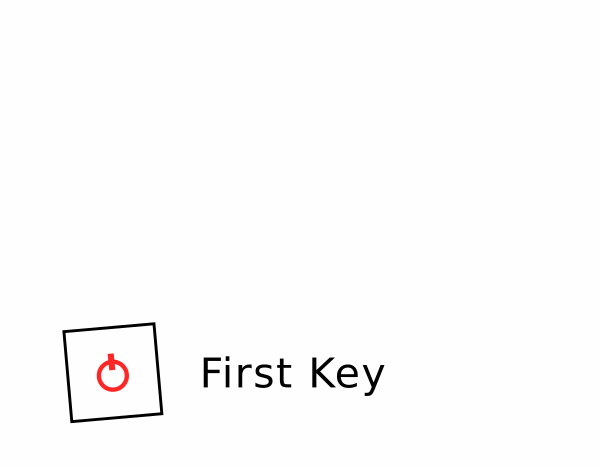

</div>

**Step 3**: When a row anchor is finalized, a key is laid out there &ndash; shown here by 18mm by 18mm squares, representing regular keycaps.
It's worth emphasizing that the keys we're generating here are always defined as the *middle points* of these visualization squares.
They're *not* the squares themselves, as we don't always necessarily want to put rectangles at these locations.

</TabItem>
<TabItem value="4" label="4">
<div style={{textAlign: 'center'}}>

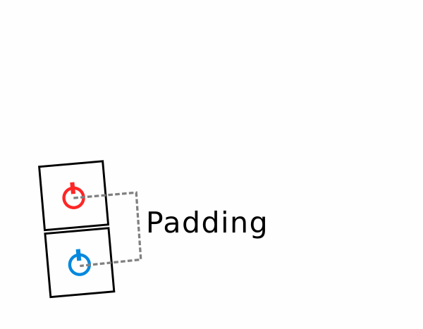

</div>

**Step 4**: Now that the first key of the column is fixed, we add `padding` to figure out where the next row should go.

</TabItem><TabItem value="5" label="5">
<div style={{textAlign: 'center'}}>


</div>

**Step 5**: And we keep doing this until we run out of rows in the current column &ndash; cumulatively, always adding `padding` (and potential `orient`/`shift`/`rotate` modifiers) to get to the next location.

</TabItem>
<TabItem value="6" label="6">
<div style={{textAlign: 'center'}}>

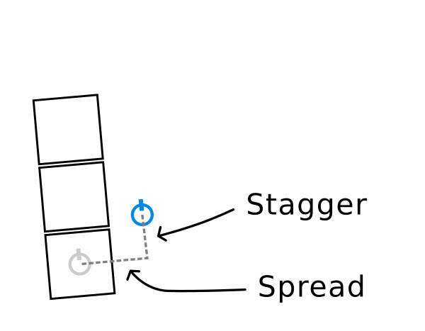

</div>

**Step 6**: Once the current column is done, we move on to the next column by applying `spread` (to move horizontally) and `stagger` (to move vertically).
Note that the column anchor is still "skewed" at the original 5° rotation.

</TabItem>
<TabItem value="7" label="7">
<div style={{textAlign: 'center'}}>


</div>

**Step 7**: After `spread`ing and `stagger`ing, inter-column `splay` is applied &ndash; again, cumulatively.
By default, `splay`ing happens "around" the point itself, so it doesn't affect its x/y position, only its rotation.
But we can change this with an optional `origin` to rotate around.
In this case, it's used so that the column hinges around the first key's bottom left corner (so that the rotation doesn't accidentally make that exact corner overlap the first column, as it would during sufficient rotation around the key's center).
Note that this `splay` takes us back to 0° (upright) rotation.

</TabItem>
<TabItem value="8" label="8">
<div style={{textAlign: 'center'}}>

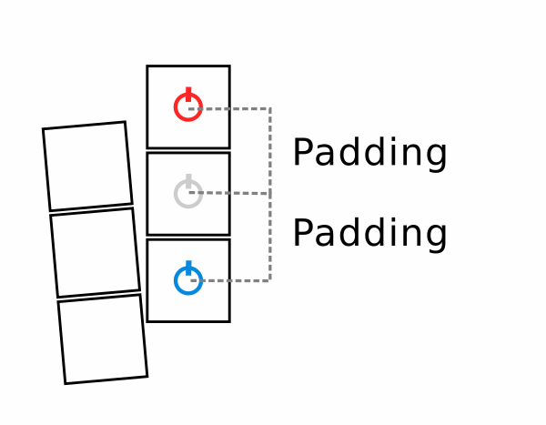

</div>

**Step 8**: From this new column anchor, we can repeat the same in-column process we saw before: copy it to a running row anchor, and create the column's relevant rows one by one, leaving `padding` in between stops.

</TabItem>
<TabItem value="9" label="9">
<div style={{textAlign: 'center'}}>

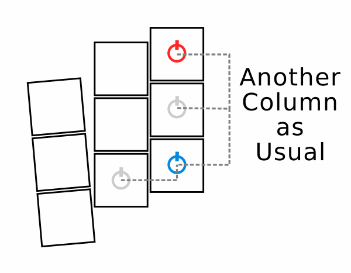

</div>

**Step 9**: And now steps 6-7-8, again.
We create the new column anchor by `spread`ing/`stagger`ing/`splay`ing the old one, and lay out the next column, row by row.

</TabItem>
<TabItem value="10" label="10">
<div style={{textAlign: 'center'}}>


</div>

**Step 10**: Same old, same old, only now the `stagger` value is negative.

</TabItem>
<TabItem value="11" label="11">
<div style={{textAlign: 'center'}}>

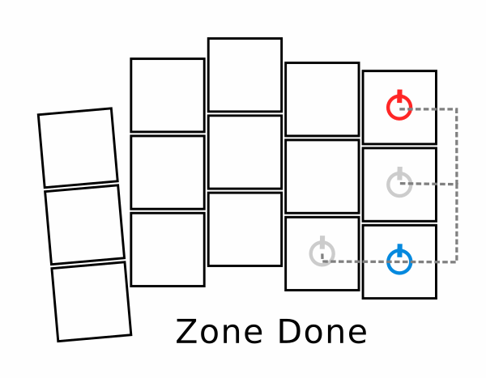

</div>

**Step 11**: Once more for the inner column, and we're done with this zone.

</TabItem>
</Tabs>

<hr/>


Once we have an existing zone (`matrix`), we can anchor further zones to it &ndash; like, say, a thumbfan.

<Tabs>
<TabItem value="config" label="Config" default>

```yaml

```

</TabItem>
<TabItem value="1" label="1">
<div style={{textAlign: 'center'}}>

<!--  -->

</div>

**Step 1**: 

</TabItem>
</Tabs>

<hr/>


### Examples

<details><summary>Choc spacing</summary>
<p>

arst neio

<Tabs>
<TabItem value="config" label="Config" default>

```yaml

```

</TabItem>
<TabItem value="visualization" label="Visualization">
<div style={{textAlign: 'center'}}>

<!--  -->

</div>
</TabItem>
</Tabs>

</p>
</details>

<details><summary>Row overrides</summary>
<p>

arst neio

<Tabs>
<TabItem value="config" label="Config" default>

```yaml

```

</TabItem>
<TabItem value="visualization" label="Visualization">
<div style={{textAlign: 'center'}}>

<!--  -->

</div>
</TabItem>
</Tabs>

</p>
</details>

<details><summary>Column arcs</summary>
<p>

arst neio

<Tabs>
<TabItem value="config" label="Config" default>

```yaml

```

</TabItem>
<TabItem value="visualization" label="Visualization">
<div style={{textAlign: 'center'}}>

<!--  -->

</div>
</TabItem>
</Tabs>

</p>
</details>


## Adjustments

Once we're done with zone-specific definitions, we can adjust the individual zones as a whole, or even all the zones collectively.
The corresponding config sections look something like this:

```yaml
points:
  zones:
    zone_name:
      rotate: <number> # zone-level rotation
      mirror: <axis> # zone-level mirror
  rotate: <number> # global rotation
  mirror: <axis> # global mirror
```


### Rotation

In this context, `rotate` can apply an angle to all relevant points, most often used to simulate the inter-half angle of one-piece boards.
If specified at the zone level, it applies to the points of that zone only &ndash; if specified globally, it applies to all points.

The origin of the rotation is always assumed to be `[0, 0]`.
This doesn't matter for global rotations, but should be considered for zone-level ones.


### Mirroring

At this stage, all "original" points are declared and positioned.
And since the default direction in Ergogen is left-to-right, this usually means the left side of the board.
But there's usually two sides to a board, so to save us the work of replicating everything on the right, Ergogen offers a way to mirror "source" points automatically along an axis.

If the `mirror` field is a number, it will be used as the x coordinate of the axis to mirror along.
Otherwise, it's going to be treated as an anchor with an additional `distance` field, where the anchor defines an arbitrary reference point and `distance` defines how far away it should be from its eventual mirror image.

As with rotation, mirroring can be applied to individual zones, or all of them simultaneously at the end, depending on which of the above two `mirror` declarations we use.

:::caution
The `mirror` field can have different meanings depending on its location in the config.
As we just saw, `points.mirror` and `points.zones.<zone_name>.mirror` are for declaring what points should be mirrored to the other side and along what axis.
These are not to be confused with the key-level `mirror` attribute (appearing at any of the 6 levels we've discussed for [inheritance](#inheritance)), which provides a way to override any other key-level attribute for mirrored versions of points.
:::

Now if our design is symmetric, we're done.
Otherwise, we need to use the `asym` key-level attribute to indicate which side any given point should appear on.
If it's set as `source`, mirroring will simply skip this key, as it should only be present on the source side, as it was declared.
If the `asym` field is set as `clone`, mirroring will "move" the point instead of copying it, because it should only appear on the mirrored side.
The default value of `both` assumes symmetry &ndash; so the given point should appear on both sides of the board.

:::tip
The `source`/`clone` pair was chosen to replace the old `left`/`right` as the canonical options for the `asym` field so as not to make any hardcoded assumptions about the spatial relationships between original and mirrored positions.
But as aliases, `origin`/`image`, `base`/`derived`, `primary`/`seconday` and even the old `left`/`right` pairs are also supported, so feel free to use whichever makes most sense to you.
:::

And this concludes point definitions.
This should be generic enough to describe any ergo layout, yet hopefully easy enough so that you'll appreciate not having to work in raw CAD.


### Examples

<details><summary>Zone-level adjustment</summary>
<p>

arst neio

<Tabs>
<TabItem value="config" label="Config" default>

```yaml

```

</TabItem>
<TabItem value="visualization" label="Visualization">
<div style={{textAlign: 'center'}}>

<!--  -->

</div>
</TabItem>
</Tabs>

</p>
</details>

<details><summary>Post-adjustment zones</summary>
<p>

arst neio

<Tabs>
<TabItem value="config" label="Config" default>

```yaml

```

</TabItem>
<TabItem value="visualization" label="Visualization">
<div style={{textAlign: 'center'}}>

<!--  -->

</div>
</TabItem>
</Tabs>

</p>
</details>

<details><summary>Asymmetry</summary>
<p>

arst neio
- don't forget a key-level mirror example here, too

<Tabs>
<TabItem value="config" label="Config" default>

```yaml

```

</TabItem>
<TabItem value="visualization" label="Visualization">
<div style={{textAlign: 'center'}}>

<!--  -->

</div>
</TabItem>
</Tabs>

</p>
</details>
